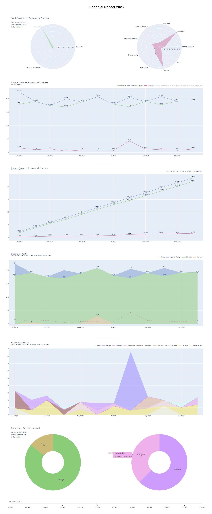

# Expenses Tracker

## Author

Daniele Passabì

## Apps

### Supported

The natively supported apps follows.

| Application      | Store Link |
| ---------------- | ---------- |
| *dummy*          | a simple run with toy data |
| *fleur*          | <https://apps.apple.com/it/app/fleur-gestione-spese-e-budget/id1621020173>
| *1money*         | <https://play.google.com/store/apps/details?id=org.pixelrush.moneyiq&hl=it&pli=1>
| *inbank*         | <https://play.google.com/store/apps/details?id=it.phoenixspa.inbank&hl=it&gl=US>

### Custom

If your app is not supported, do not worry!

You can launch a run with `app=custom`, providing also your specific `app_custom_dict`.
The latter is a dictionary with all the needed transformations to obtain a dataset with the following structure:

| Index | Date       | Transaction Type | Account  | Category            | Amount | Notes |
|-------|------------|------------------|----------|---------------------|--------|-------|
| 0     | 2023-06-30 | Spesa            | Risparmi | Food                | 2.00   | NaN   |
| 1     | 2023-06-28 | Spesa            | Risparmi | Food                | 20.00  | NaN   |
| 2     | 2023-06-28 | Spesa            | Risparmi | Car                 | 42.35  | NaN   |

Here's an example of a `app_custom_dict`:

```python
{
  'delete_rows': {
    'start': 0,
    'end': -5
  },
  'columns_to_drop': ['TAG','VALUTA 2','IMPORTO 2','VALUTA'],
  'columns_to_rename': {
    'DATA': 'Date',
    'TIPOLOGIA': 'Transaction Type',
    'AL CONTO / ALLA CATEGORIA': 'Category',
    'IMPORTO': 'Amount',
    'NOTE': 'Notes',
    'DAL CONTO': 'Account'
  },
  'values_to_rename': {
    'Transaction Type': {
      'Entrata': 'Reddito'
    }
  },
  'date_format': '%d/%m/%y'
}
```

## Report

It follows an example of report, generated using some dummy data for the year 2023.

<p align="center">
  
</p>
